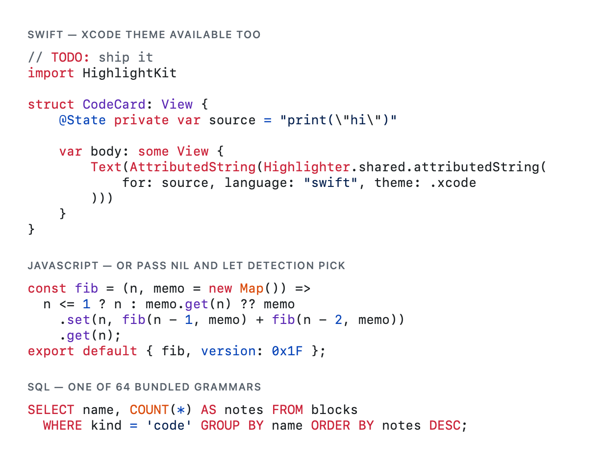
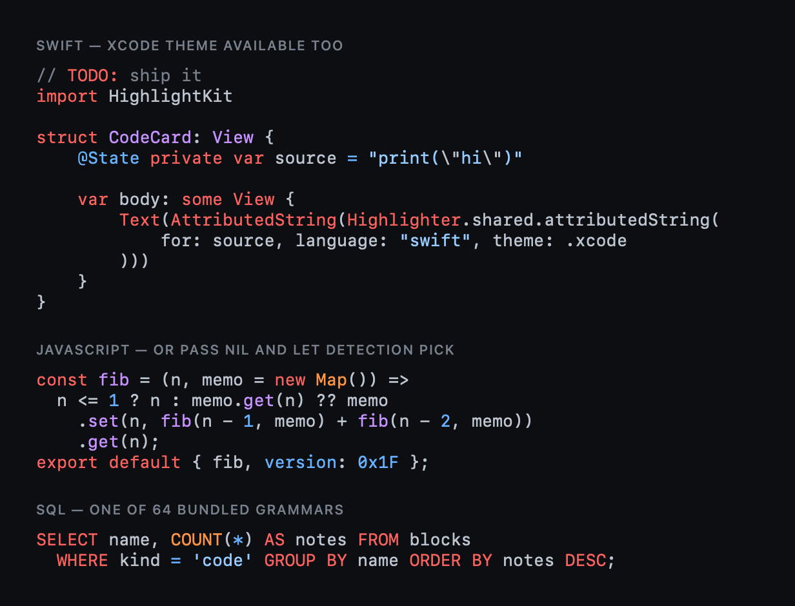
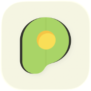

# HighlightKit

**highlight.js-compatible syntax highlighting in pure Swift — no JavaScript engine, no WebView, no HTML round-trip.**

<p>
  <a href="https://github.com/PhraseHQ/HighlightKit/actions/workflows/ci.yml"></a>
  
  
  <a href="LICENSE"></a>
  <a href="https://phrase.so?utm_source=github&utm_medium=readme&utm_campaign=highlightkit"></a>
</p>

HighlightKit is a ground-up Swift port of [highlight.js](https://highlightjs.org) 11.11.1, built and maintained by the team behind [Phrase](https://phrase.so?utm_source=github&utm_medium=readme&utm_campaign=highlightkit) — it highlights every code block in Phrase's AI notes on iOS and macOS. **71 languages, token-exact output verified against the reference fixture corpus on every test run**, and native `NSAttributedString` rendering on every Apple platform. See [fidelity and differential-testing details](Docs/FIDELITY.md).

<table>
  <tr>
    <th>Light</th>
    <th>Dark — adaptive themes built in</th>
  </tr>
  <tr>
    <td></td>
    <td></td>
  </tr>
</table>

<sub>Generated straight from the library by
`Tests/HighlightKitTests/ScreenshotGenerator.swift` — regenerate with
`HIGHLIGHTKIT_SCREENSHOTS=.github/assets swift test --filter Screenshot`.</sub>

## Why

The popular syntax highlighters for Apple platforms wrap highlight.js in JavaScriptCore, render HTML, and parse that HTML back into an attributed string — a JS context per highlighter, string round-trips on every call, and a failable initializer for when the bundle doesn't load. HighlightKit is the same battle-tested grammar semantics as a native library:

- **Pure Swift 6.1** — strict concurrency on the runtime API, `Synchronization` primitives, and zero package dependencies. `Highlighter()` cannot fail.
- **Tokens, not HTML** — every token is an `NSRange` (UTF-16, `NSTextStorage`-aligned) plus a scope name, so you can drive your own renderer or editor, or use the built-in `NSAttributedString` path.
- **Token-exact** — 381 upstream-derived and adversarial fixtures, with expectations generated by pinned reference grammars, pin every release token for token.
- **Typed themes** — GitHub and Xcode styles in light, dark, and *adaptive* variants: one attributed string follows the system appearance without re-highlighting.
- **Built for editors** — cancellable continuation-threaded documents, bounded overlay rendering and result caching, plus processor-bounded automatic detection across 71 grammars.

## Installation

Swift Package Manager. In `Package.swift`:

```swift
dependencies: [
    .package(url: "https://github.com/PhraseHQ/HighlightKit.git", exact: "0.3.0")
]
```

Platforms: iOS 18+, macOS 15+, tvOS 18+, watchOS 11+, visionOS 2+. The
core engine (parsing, tokens) uses Foundation and Synchronization; the rendering
layer uses UIKit/AppKit colors and fonts.

## Usage

One call for the common case:

```swift
import HighlightKit

label.attributedText = try Highlighter.shared.attributedString(
    for: code, selection: .named("swift"), theme: .xcode
)
```

Use `.automatic` to detect or `.plain` for intentional unhighlighted output.
Unknown names throw instead of silently returning plain text. Themes:
`.github` / `.xcode` (adaptive),
their `Light`/`Dark` variants, by-name lookup with
`HighlightTheme.named("github-dark")`, or build your own from typed
scope styles and a font:

```swift
let theme = HighlightTheme(
    foregroundColor: .black,
    backgroundColor: .white,
    font: .init(name: "SF Mono", size: 13),
    styles: [
        .keyword: ScopeStyle(color: .systemPink, bold: true),
        .string: ScopeStyle(color: .systemRed),
        .comment: ScopeStyle(color: .gray, italic: true),
        "my-custom-scope": ScopeStyle(color: .cyan), // open set
    ]
)
```

`HighlightScope` is typed like `Notification.Name` — autocomplete and
typo safety for the ~50 standard scopes, string literals for custom ones,
and dot-path scopes (`.titleFunction`) resolve through structural
fallback.

### Tokens

```swift
let result = try Highlighter.shared.highlight(code, selection: .named("swift"))
for token in result.tokens {
    print(token.range, token.scope)   // NSRange + "keyword", "title.function", …
}
```

### Automatic language detection

```swift
let result = try await Highlighter.shared.highlight(
    code,
    selection: .automatic
) // processor-bounded parallel scan
print(result.language ?? "plain", result.relevance, result.secondBest?.language ?? "-")
```

The `async` overload runs candidates through a processor-bounded child-task
window. When not cancelled, it returns the same ranked result as the
synchronous overload. Cancellation throws `CancellationError` and never
returns a partial candidate.

### Repository language resolution

```swift
let selection = try await Highlighter.shared.resolveLanguage(
    for: code,
    path: repositoryPath,
    interpreter: nil,
    override: nil
)
let result = try await Highlighter.shared.highlight(code, selection: selection)
```

Descriptors expose extensions, exact filenames, and interpreters. Ambiguous
extensions such as `.h` and `.m` use strict content detection over only their
matched candidates. See [repository resolution](Docs/LANGUAGE_RESOLUTION.md).

### Overlay rendering and caching

```swift
let cache = HighlightCache(costLimit: 16 * 1024 * 1024)
let result = try await Highlighter.shared.highlight(
    code,
    selection: .named("swift"),
    cache: cache,
    cacheKey: HighlightCacheKey(namespace: "git-blob", value: blobOID)
)

let renderer = HighlightRenderer(theme: .githubDark)
try renderer.apply(result, to: textStorage)
```

The reusable renderer preserves caller attributes and supports UTF-16 range
mapping plus exact rendered-run budgets. The explicit cache stores complete,
theme-independent token results and coalesces identical work; no cache is
installed in `Highlighter.shared`.

### Incremental highlighting (editors)

Let the actor-isolated document manage line tokens and parser checkpoints so
edits only re-highlight what changed:

```swift
let document = try await HighlightedDocument(
    text: source,
    selection: .named("swift")
)
try await document.replaceCharacters(in: editedUTF16Range, with: replacement)
let visible = try await document.snapshot(in: visibleUTF16Range, maximumTokens: 500)
```

The document reparses from a continuation checkpoint and reuses an unchanged
suffix when parser state converges. A line-isolated regex cannot observe
lookaround or boundaries across a chunk edge, so whole-block highlighting
remains the exact path for constructs that depend on cross-line regex context.
See [the documented incremental
limits](Docs/FIDELITY.md#incremental-line-by-line-highlighting).

### Custom grammars

```swift
let highlighter = Highlighter(languages: [.swift, .javascript]) // just what you need
highlighter.register(myLanguage)                                // or your own grammar
```

Grammars compile lazily on first use and are cached per instance; the
shared instance's cost scales with the languages you actually highlight.

## Performance

Measured in a production release build on an Apple M3 Max (see
[BENCHMARKS.md](BENCHMARKS.md) for the dated environment, workloads, and
reproduction protocol):

| Workload | Result |
|---|---|
| JavaScript throughput (62 KB, grammar-heavy) | 1.12 MU/s (≈ MB/s for ASCII) |
| Swift throughput (real Swift source) | 1.84 MU/s |
| SQL / JSON throughput | ~2 MU/s |
| Incremental JavaScript, per line (the editor path) | ~36 µs |
| Auto-detect across 65 languages, warm (0.2 historical baseline) | 3.3 ms |
| `NSAttributedString` rendering | ~7.6 MU/s |
| Cold start (first highlight, incl. grammar compile) | ~4 ms |

The engine replaces highlight.js's combined-alternation scan with per-rule
windowed match caching plus shape-specialized prefilters — roughly 10×
the naive port. Every optimization was adopted or rejected on
measurements, and differential test suites keep each hand-written fast
path pinned to ICU semantics.

## Languages

All 71 grammars ship in the package; `Highlighter.shared.languageNames`
lists them. Ada, Apache, AppleScript, ARM assembly, Bash, BASIC, C,
Clojure, CMake, CoffeeScript, C++, C#, CSS, Dart, Delphi, Diff,
Dockerfile, DOS, Elixir, Elm, Erlang, Fish, Fortran, F#, Go, GraphQL,
Groovy, Haskell, HCL/Terraform, HTTP, INI/TOML, Java, JavaScript, JSON,
Kotlin, Leaf, Less, Lisp, LLVM IR, Lua, Makefile, Markdown, MATLAB, Nginx,
Nim, Nix, Objective-C, OCaml, Perl, PHP, plaintext, PowerShell, Prolog,
Properties, Protocol Buffers, Python, R, Ruby, Rust,
Scala, Scheme, SCSS, Shell session, SQL, Stylus, Swift, TypeScript, Vim
script, XML/HTML, YAML, Zig.

## Testing

`swift test` runs the unit, integration, stress, and 381-case token-exact
fidelity suites, including
differential and adversarial checks for specialized matcher paths,
incremental-state regressions, hostile-input handling, and memory-stability
stress. Run concurrency instrumentation separately after registry,
continuation, callback, or other shared-state changes:

```sh
swift test --sanitize=thread \
  --filter 'LanguageRegistryTests|IncrementalTests|StressTests|CoreCoverageCompletionTests|HighlightCacheTests|HighlightedDocumentTests'
```

---

<div align="center">

  <a href="https://phrase.so?utm_source=github&utm_medium=readme&utm_campaign=highlightkit">
    
  </a>

  <h3><a href="https://phrase.so?utm_source=github&utm_medium=readme&utm_campaign=highlightkit">Phrase — Turn Recordings & PDFs into AI Notes</a></h3>

  <p><b>Capture anything. Turn it into notes you can trust.</b><br>
  Phrase turns recordings, PDFs, images, and videos into source-backed AI notes,<br>
  slide decks, study tools, and dashboards — Apple-native, for notes that need proof.<br>
  HighlightKit is the engine that highlights every code block in Phrase.</p>

  <p>
    <a href="https://apps.apple.com/app/phrase/id6779970822">
      
    </a>
    &nbsp;
    <a href="https://phrase.so?utm_source=github&utm_medium=readme&utm_campaign=highlightkit">
      
    </a>
    &nbsp;
    <a href="https://x.com/phraseapp">
      
    </a>
  </p>
</div>

---

## Contributing

See [CONTRIBUTING.md](CONTRIBUTING.md) — the short version: keep the 381
token-exact fixtures green, pin matcher fast paths with differential
tests, and bring numbers for performance claims. Security reports:
[SECURITY.md](SECURITY.md).

## License

MIT — see [LICENSE](LICENSE). HighlightKit derives from
[highlight.js](https://highlightjs.org) (BSD 3-Clause); see
[THIRD_PARTY_NOTICES.md](THIRD_PARTY_NOTICES.md).

Built by [Phrase](https://phrase.so?utm_source=github&utm_medium=readme&utm_campaign=highlightkit).
